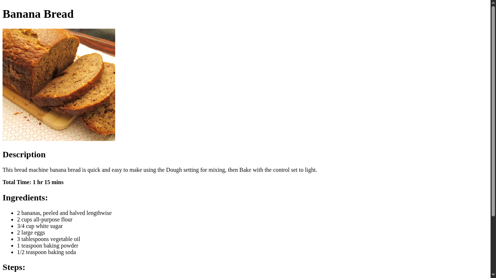

# odin-recipes

A website with a bunch of recipes you can follow to cook delicious food

# Preview

## Live

[LinkLive](https://wenardken57.github.io/odin-recipes/)

# Demonstrated skill in this project

- Set up HTML page
- Link created pages: relative and absolute link
- Adding images
- Creating list: ordered and unordered
- Display paragraph text
- Using git: staging, commiting and pushing to remote repository